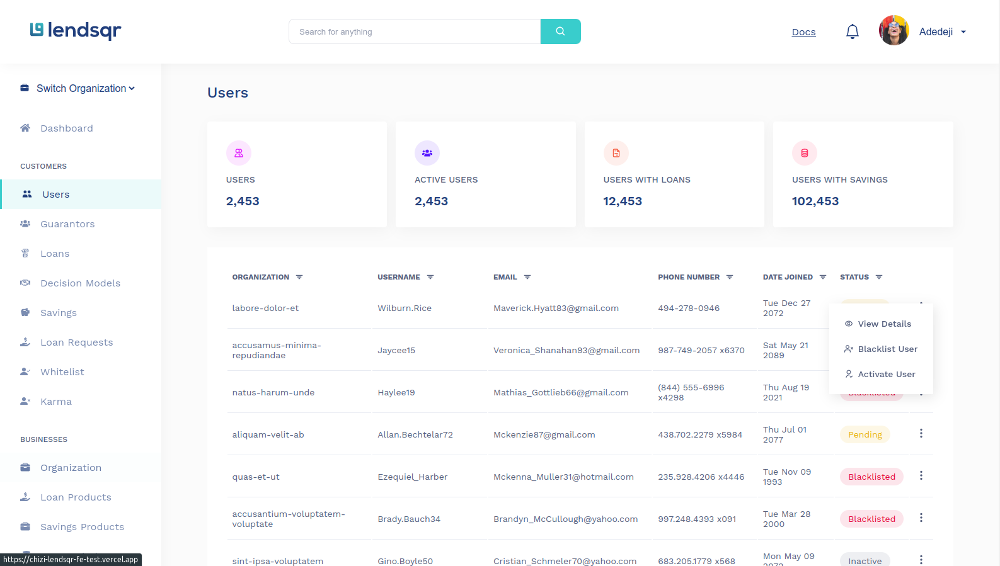

<p align="center">
  </a>
</p>

# <p align="center">LENDSQR Frontend Test</p>

<p align="center">
  <a href="" rel="noopener">
 </a>
</p>

<div align="center">

[]()
[](https://github.com/chizidotdev/lendsqr-fe-test/issues)
[](https://github.com/chizidotdev/lendsqr-fe-test/pulls)

</div>

---

## 📝 Table of Contents

- [About](#about)
- [Getting Started](#getting_started)
- [Usage & Folder Structure](#usage)
- [Deployment](#deployment)
- [Authors](#authors)

## 🧐 About <a name = "about"></a>

<p>

At Lendsqr, many of our lenders use our mobile apps to reach over half a million customers. At this scale, we use React with TypeScript and SCSS as its frontend software development stack which allows us to rapidly ideate and release features rapidly and reliably.

To prepare for you as a possible frontend engineer at Lendsqr, we would require that you create an application using React with SCSS. This test will allow us to assess your strengths and weaknesses.

#### Assessment:

Given the design [here,](https://www.figma.com/file/ZKILoCoIoy1IESdBpq3GNC/FrontendTesting?node-id=5530%3A0) which has sample pages to be built.

- Build the 4 pages Login, Dashboard, User page, User details page
- The user pages should pull data from a mock api with 500 records
- Use local storage or indexedDB to store and retrieve user details on the user details page.
- The page must be mobile responsive

Tech Stack:

React with TypeScript
SCSS

</p>

## 🏁 Getting Started <a name = "getting_started"></a>

These instructions will get you a copy of the project up and running on your local machine for development and testing purposes. See [Usage](#usage) for notes on folder and file structure.

### Installing

```
npm install

// or

yarn
```

Then run the app with

```bash
yarn start
```

### 🔧 Running the tests <a name = "tests"></a>

For automated tests, run

```
yarn test
```

## 🎈 Usage & Folder Structure <a name="usage"></a>

    .
    ├── public/
    ├── src/              # All source code goes here
    ├   ├── components/
    ├   ├── pages/
    ├   ├── styles/
    ├   ├   ├── font/
    ├   ├── hooks/
    ├   ├── utils/
    ├   ├── App.tsx
    ├   ├── index.tsx
    ├── .gitignore
    ├── .package.json
    ├── tsconfig.json
    ├── README.md

## ⛏️ Built Using <a name = "built_using"></a>

- [Typescript](https://typescriptlang.org/) - Programming Language
- [ReactJS](https://www.reacjs.org/) - Fronted Web Library
- [SCSS](https://sass-lang.com/) - CSS preprocessor

## ✍️ Authors <a name = "authors"></a>

- [Chizi Victor](https://github.com/chizidotdev) - Frontend Engineer
